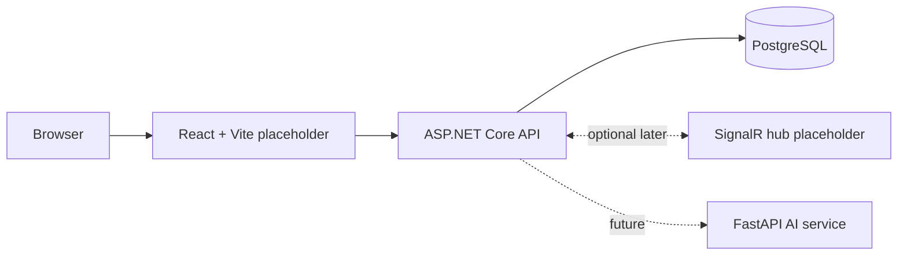

# Architecture Scaffold

This document describes the prepared project structure only. It does not describe implemented gameplay.

## Prepared Services

- Frontend runs at `http://localhost:5173`
- Backend runs at `http://localhost:5088`
- PostgreSQL runs at `localhost:5432`
- AI service runs at `http://localhost:8001`

## Current Backend Endpoints

- `GET /health`
- `GET /ready`
- `GET /swagger`
- `/hubs/game` SignalR placeholder

## Current AI Endpoints

- `GET /health`
- `GET /ready`

## Future Work

The team should define the game model, API contracts, database schema, AI agent behavior, and frontend screens when actual development begins.
