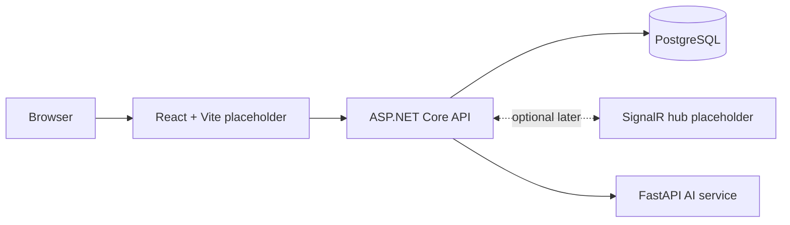

# Architecture Scaffold

This document describes the prepared project structure only. It does not describe implemented gameplay.

## Prepared Services

- Frontend runs at `http://localhost:5173`
- Backend runs at `http://localhost:5088`
- PostgreSQL runs at `localhost:5432`
- AI service runs at `http://localhost:8001`

## Current Backend Endpoints

- `GET /health`
- `GET /ready`
- `GET /swagger`
- `GET /api/levels`
- `POST /api/craft`
- `POST /api/companion/comments`
- `/hubs/game` SignalR placeholder

## Current AI Endpoints

- `GET /health`
- `GET /ready`
- `POST /craft`

## Crafting Flow

The frontend sends the unchanged craft request to the backend. The backend loads the session, level, and inventory, then calls the AI service with:

- selected elements
- level name and difficulty
- goal element
- current inventory

The AI service first checks deterministic baseline recipes. Unknown combinations can use local Ollama generation, and invalid or unavailable model responses fall back to a stable deterministic result.

## Future Work

The team should expand deterministic recipe coverage, define guaranteed multi-step level paths, connect difficulty metadata to level design, and decide how companion hints or voice acting should consume crafting context.
